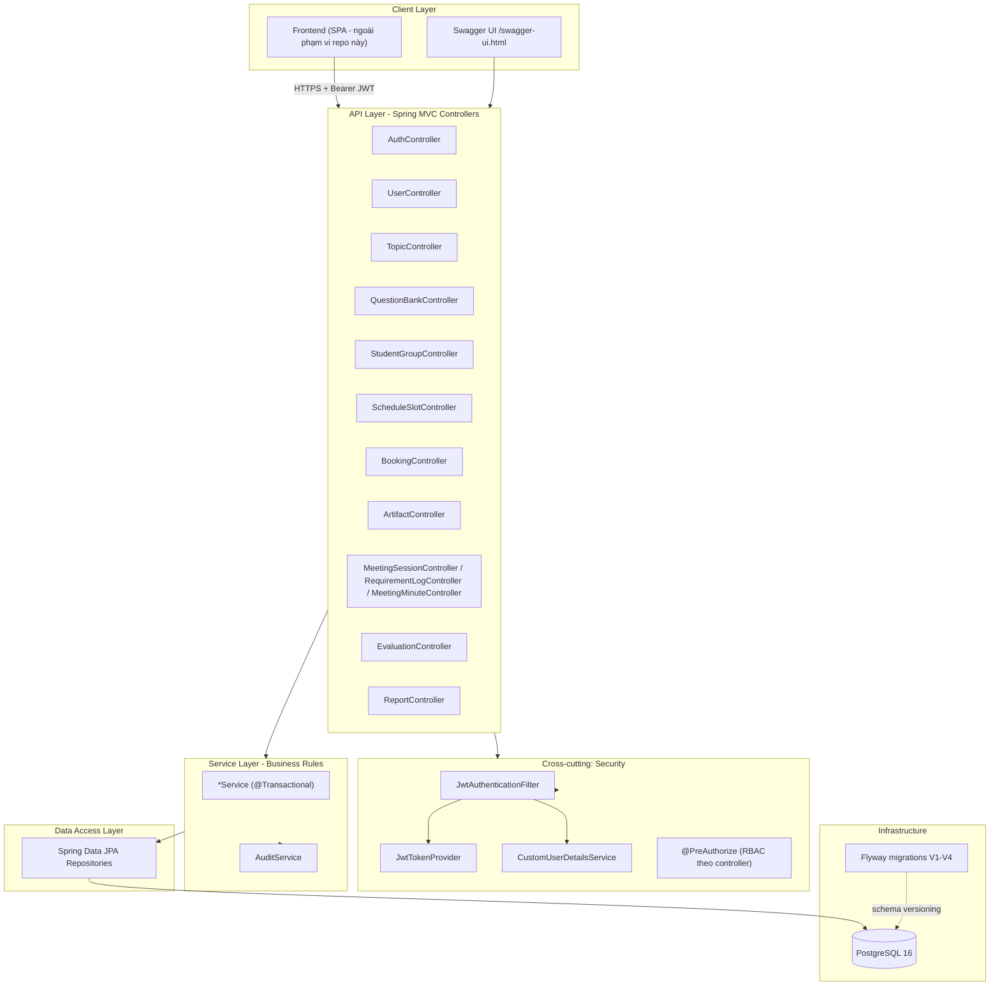
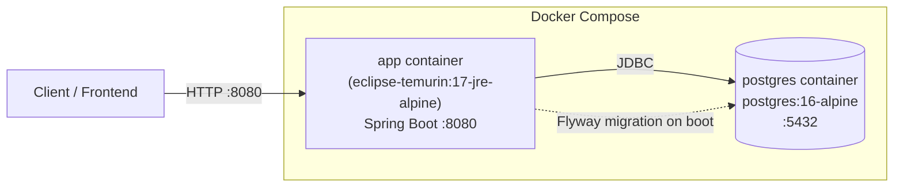

# Danh sách tính năng & Kiến trúc hệ thống

**Dự án:** Capstone Project Progress Tracking System (Student Schedule and Guidance Management System)
**Phạm vi tài liệu:** Tổng hợp từ code hiện có trên nhánh `feat/student-join-group` (không chỉ từ kế hoạch trong `blueprint.md`) để phản ánh đúng những gì đã chạy được.
**Nguồn đối chiếu:** `blueprint.md` (đặc tả 15 mục), `intent.md` (bối cảnh), `docs/erd.mmd` (data model), `README.md` (bảng trạng thái theo sprint).

---

## 1. Danh sách tính năng (Feature List)

Ký hiệu trạng thái: ✅ Hoàn chỉnh (có endpoint + service + rule nghiệp vụ) · 🟡 Có nền tảng, chưa đủ theo đặc tả · ⚪ Chưa triển khai.

### 1.1. Xác thực & Người dùng (Auth & Users)
| # | Tính năng | Endpoint | Vai trò | Trạng thái |
|---|---|---|---|---|
| 1 | Đăng ký tài khoản (giới hạn domain email, mặc định `@fpt.edu.vn`, cấu hình được) | `POST /api/v1/auth/register` | Public | ✅ |
| 2 | Đăng nhập, phát hành JWT (access + refresh) | `POST /api/v1/auth/login` | Public | ✅ |
| 3 | Xem thông tin tài khoản hiện tại | `GET /api/v1/auth/me` | Đã đăng nhập | ✅ |
| 4 | Quản trị người dùng (tạo, liệt kê, xem, cập nhật) | `POST/GET /api/v1/users`, `GET/PUT /api/v1/users/{id}` | Admin | ✅ |
| 5 | Đăng nhập Google SSO | — | — | ⚪ (hạ tầng JWT sẵn sàng để cắm vào, chưa nối OAuth2 client — xem `intent.md` A-005) |

### 1.2. Đề tài & Ngân hàng câu hỏi (Topics & Question Bank)
| # | Tính năng | Endpoint | Vai trò | Trạng thái |
|---|---|---|---|---|
| 6 | Tạo/sửa đề tài | `POST/PUT /api/v1/topics`, `/{id}` | Admin | ✅ |
| 7 | Xem danh sách/chi tiết đề tài | `GET /api/v1/topics`, `/{id}` | Mọi vai trò | ✅ |
| 8 | Quản lý ngân hàng câu hỏi theo đề tài | `POST/GET /api/v1/topics/{topicId}/questions` | Admin tạo, mọi vai trò xem | ✅ |

### 1.3. Nhóm sinh viên (Student Groups)
| # | Tính năng | Endpoint | Vai trò | Trạng thái |
|---|---|---|---|---|
| 9 | Tạo nhóm | `POST /api/v1/groups` | Admin, Instructor, **Student** (tự tạo nhóm) | ✅ |
| 10 | Xem danh sách nhóm (lọc theo supervisor/topic, hoặc chỉ nhóm còn chỗ) | `GET /api/v1/groups?available=true` | Mọi vai trò | ✅ — `available=true` chỉ trả nhóm còn dưới 5 thành viên active |
| 11 | Xem chi tiết nhóm + danh sách thành viên | `GET /api/v1/groups/{id}` | Mọi vai trò | ✅ |
| 12 | Cập nhật thông tin nhóm (đề tài, supervisor, học kỳ, trạng thái) | `PUT /api/v1/groups/{id}` | Admin, Instructor | ✅ |
| 13 | **Sinh viên tự tham gia nhóm (self-join)** | `POST /api/v1/groups/{id}/join` | Student | ✅ — mới trên nhánh này; chặn nếu SV đã thuộc 1 nhóm active khác, chặn nếu nhóm đã đủ 5 thành viên active |
| 14 | Thêm thành viên vào nhóm (do người quản lý thêm) | `POST /api/v1/groups/{id}/members` | Admin, Instructor, Group Leader | ✅ |
| 15 | Gỡ thành viên khỏi nhóm (tự động hạ quyền Group Leader → Student nếu gỡ leader) | `DELETE /api/v1/groups/{id}/members/{memberId}` | Admin, Instructor, Group Leader | ✅ |
| — | Giới hạn tối đa **5 thành viên active/nhóm** | — (rule dùng chung cho #9, #13, #14) | — | ✅ |

> Ghi chú kiến trúc nghiệp vụ: đây là phần mở rộng so với `blueprint.md` gốc — bản đặc tả ban đầu chỉ có "Admin/Instructor thêm thành viên" (UC ngầm định), nhánh hiện tại bổ sung luồng self-service cho sinh viên tự lập nhóm/tự tham gia, phù hợp hơn với thực tế vận hành lớp học.

### 1.4. Lịch đánh giá & Đặt chỗ (Assessment Scheduling — mô hình Calendly)
| # | Tính năng | Endpoint | Vai trò | Trạng thái |
|---|---|---|---|---|
| 16 | Tạo/xem khung giờ (slot) | `POST/GET /api/v1/slots`, `GET /api/v1/slots/{id}` | Instructor/Admin tạo, mọi vai trò xem | ✅ — khớp API-001/002, có rule chống trùng slot cùng giảng viên |
| 17 | Đặt chỗ vào slot | `POST /api/v1/slots/{id}/book` | Group Leader | ✅ — khớp API-003, khóa `SELECT ... FOR UPDATE` chống race condition |
| 18 | Hủy lịch hẹn (có cửa sổ chặn hủy trễ) | `DELETE /api/v1/bookings/{id}` | Leader/Instructor | ✅ — khớp API-004 |
| 19 | Thông báo email/in-app xác nhận & nhắc lịch | — | — | ⚪ Chưa triển khai (FR-003, "Should") |

### 1.5. Nộp tài liệu tiến độ (Artifacts)
| # | Tính năng | Endpoint | Vai trò | Trạng thái |
|---|---|---|---|---|
| 20 | Nộp / liệt kê artifact của nhóm | `POST/GET /api/v1/groups/{groupId}/artifacts` | Group Member | ✅ — client tự cung cấp `fileUrl` (chưa có file storage service riêng) |
| 21 | Xem chi tiết artifact | `GET /api/v1/artifacts/{id}` | Mọi vai trò liên quan | ✅ |
| 22 | Duyệt artifact (accept) | `POST /api/v1/artifacts/{id}/accept` | Instructor | ✅ — nộp lại cùng tiêu đề tự động supersede bản cũ (versioning) |

### 1.6. Hỗ trợ buổi họp & Biên bản (Meetings & Minutes)
| # | Tính năng | Endpoint | Vai trò | Trạng thái |
|---|---|---|---|---|
| 23 | Tạo phiên họp gắn với booking; bắt đầu/kết thúc phiên | `POST /api/v1/bookings/{bookingId}/meetings`, `.../start`, `.../end` | Leader/Instructor | ✅ |
| 24 | Ghi nhận / cập nhật yêu cầu phát sinh (Requirement Log) | `POST/GET /api/v1/meetings/{id}/requirements`, `PUT /api/v1/requirements/{id}` | Leader/Instructor | ✅ |
| 25 | Sinh bản thảo biên bản họp tự động từ ghi chú | `POST /api/v1/meetings/{id}/minutes/generate` | Leader/Instructor | ✅ — **template hóa từ text theo quy tắc cố định, không gọi AI thật** (khác kỳ vọng "AI Service" trong API-008 của blueprint) |
| 26 | Ký duyệt biên bản 2 phía (Student nộp, Instructor duyệt/từ chối) | `PUT /api/v1/meetings/{id}/minutes/sign` | Leader (submit), Instructor (approve/reject) — dùng chung 1 endpoint | ✅ |
| 27 | Xem biên bản họp | `GET /api/v1/meetings/{id}/minutes` | Mọi vai trò liên quan | ✅ |

### 1.7. Đánh giá & Báo cáo (Evaluation & Reporting)
| # | Tính năng | Endpoint | Vai trò | Trạng thái |
|---|---|---|---|---|
| 28 | Chấm điểm nhóm theo 3 tiêu chí (Topic Fit / Product Quality / Communication) | `POST /api/v1/groups/{groupId}/evaluations` | Instructor | ✅ — tạo là **Published ngay** (one-click "Save and Publish" theo UC-004), tự tính điểm trọng số |
| 29 | Xem chi tiết đánh giá | `GET /api/v1/evaluations/{id}` | Vai trò liên quan | ✅ |
| 30 | Báo cáo thống kê tổng hợp | `GET /api/v1/reports/summary` | **Admin** | ✅ — khớp API-011 nhưng thu hẹp quyền so với blueprint (không có role "Dept Head" trong hệ thống thực tế) |

### 1.8. Cơ chế nền (Cross-cutting)
| # | Tính năng | Vị trí | Trạng thái |
|---|---|---|---|
| 31 | Audit Trail bất biến cho các hành động thay đổi trạng thái | `AuditService` + bảng `system_audit_trail`, gọi bên trong cùng transaction (`Propagation.MANDATORY`) của booking/cancel; cần mở rộng sang minutes/evaluation | 🟡 Nền tảng đã có, chưa phủ hết mọi service (đúng như README ghi nhận) |
| 32 | RBAC 4 vai trò (`ADMIN`, `INSTRUCTOR`, `GROUP_LEADER`, `STUDENT`) qua `@PreAuthorize` ở tầng controller | `SecurityConfig`, từng Controller | ✅ |
| 33 | Kiểm soát sở hữu tài nguyên (VD: Group Leader chỉ thao tác được nhóm của chính mình) | — | ⚪ Known gap — hiện Group Leader có thể gọi API lịch/booking cho **bất kỳ groupId nào**, RBAC mới chặn theo vai trò chứ chưa chặn theo quyền sở hữu |

---

## 2. Kiến trúc hệ thống (System Architecture)

### 2.1. Kiểu kiến trúc
Monolith phân lớp (layered) theo package-by-feature, triển khai bằng **Spring Boot 3.3.4 / Java 17**, expose duy nhất một **REST API** (không có BFF/API Gateway riêng — phù hợp quy mô đồ án 1 học kỳ).

### 2.2. Luồng xử lý một request điển hình
1. Client gửi request kèm header `Authorization: Bearer <JWT>`.
2. `JwtAuthenticationFilter` chạy trước `UsernamePasswordAuthenticationFilter`, giải mã token bằng `JwtTokenProvider`, nạp `User` qua `CustomUserDetailsService`, set `SecurityContext` (stateless — không session, không cookie, CSRF tắt vì không có cookie surface).
3. Controller layer kiểm tra quyền qua `@PreAuthorize("hasAnyRole(...)")` (method security bật ở `SecurityConfig`), rồi validate `@RequestBody` bằng Bean Validation.
4. Service layer (`@Transactional`) thực hiện: validate nghiệp vụ → mutate entity → `auditService.record(...)` cùng transaction (đảm bảo audit log và state change commit/rollback đồng thời) → trả entity.
5. Repository layer (Spring Data JPA / Hibernate) map entity ↔ bảng Postgres; schema do Flyway quản lý hoàn toàn (`ddl-auto: validate`, Hibernate không tự sinh DDL).
6. Response được serialize qua Jackson (`non_null` inclusion) thành JSON, lỗi nghiệp vụ được `common/exception` bắt và trả mã HTTP tương ứng (400/403/404/409...).

### 2.3. Kiểm soát tương tranh (Concurrency Control) — NFR-002/R-001
- `ScheduleSlotRepository.findByIdForUpdate` lấy row lock `SELECT ... FOR UPDATE` giữ suốt transaction `BookingService.book()` ⇒ 2 request tranh chỗ cuối cùng của 1 slot bị serialize thay vì cùng đọc "còn chỗ" và cùng ghi Confirmed.
- `StudentGroupService.addMember`/`join` theo mô hình check-then-act trong cùng transaction nhưng **không** dùng row lock — chấp nhận được vì phần thua chỉ nhận lỗi 409 để thử lại, không tạo ra double-booking tài nguyên vật lý giới hạn.
- Connection pool HikariCP cố ý nhỏ (`maximum-pool-size: 15`) vì kịch bản NFR-002 (50 nhóm đồng thời) là các transaction ngắn có row-lock, không phải 50 kết nối giữ lâu — pool lớn hơn chỉ dời hàng đợi từ pool sang lock manager của Postgres.

### 2.4. Kiến trúc bảo mật (Security Architecture)
- **AuthN:** JWT tự ký (`jjwt`), access token (mặc định 60') + refresh token (7 ngày), thuật toán ký cấu hình qua `app.jwt.secret`.
- **AuthZ:** RBAC 4 vai trò `ADMIN / INSTRUCTOR / GROUP_LEADER / STUDENT`, enforce ở tầng controller bằng `@PreAuthorize` — chọn có chủ đích để mô hình phân quyền nhìn thấy được ngay trên từng endpoint thay vì ẩn trong service.
- **Public endpoints** (không cần token): `/api/v1/auth/register`, `/api/v1/auth/login`, Swagger UI, `/actuator/health`.
- **Phân loại dữ liệu nhạy cảm (§11 blueprint):** `EvaluationRecord` là *Restricted Confidential* — quy ước không trả trực tiếp entity này ra controller, phải qua DTO như `UserResponse`/`TopicResponse`.
- **Gap đã biết:** RBAC hiện chưa kiểm tra **ownership** (VD: một `GROUP_LEADER` bất kỳ có thể gọi API cho `groupId` không phải nhóm của mình) — cần bổ sung `@PreAuthorize("@groupSecurity.isLeaderOf(#groupId)")` trước khi lên môi trường thật.

### 2.5. Data Model
Xem sơ đồ đầy đủ tại `docs/erd.mmd` (sinh từ `V1__init_schema.sql` → `V4__group_topic_supervisor_optional.sql`). Tóm tắt các nhóm entity chính:
- **Định danh & tổ chức:** `USERS`, `TOPICS`, `STUDENT_GROUPS`, `GROUP_MEMBERS`
- **Học liệu:** `QUESTION_BANK_ITEMS`
- **Lịch & đặt chỗ:** `SCHEDULE_SLOTS`, `BOOKINGS`
- **Buổi họp:** `MEETING_SESSIONS`, `REQUIREMENT_LOGS`, `MEETING_MINUTES`, `ARTIFACT_SUBMISSIONS`
- **Đánh giá & audit:** `EVALUATION_RECORDS`, `SYSTEM_AUDIT_TRAIL`

### 2.6. Kiến trúc triển khai (Deployment View)

- **Build:** Dockerfile multi-stage (`maven:3.9.9-eclipse-temurin-17` build → `eclipse-temurin:17-jre-alpine` runtime), chạy bằng non-root user `spring`.
- **Cấu hình qua biến môi trường:** `DB_URL/DB_USERNAME/DB_PASSWORD`, `JWT_SECRET`, `CORS_ALLOWED_ORIGINS`, `ALLOWED_EMAIL_DOMAIN` (xem `.env.example`, `docker-compose.yml`).
- **Không có** thành phần cache (Redis) hay message queue trong kiến trúc hiện tại — mọi khóa tương tranh dựa vào Postgres row lock (mục 2.3), không phải distributed lock như đề cập ở R-001 trong blueprint.

### 2.7. Tech Stack

| Lớp | Công nghệ |
|---|---|
| Ngôn ngữ / Runtime | Java 17 |
| Framework | Spring Boot 3.3.4 (Web, Data JPA, Security, Validation) |
| Build | Maven |
| Database | PostgreSQL 16, Flyway (versioned migrations) |
| Auth | JWT (`jjwt` api/impl/jackson), BCrypt password hashing |
| API Docs | springdoc-openapi + Swagger UI |
| Testing | JUnit 5, MockMvc, Spring Security Test, H2 (in-memory, profile `test`) |
| Boilerplate | Lombok |
| Container | Docker, Docker Compose |

### 2.8. Điểm khác biệt so với `blueprint.md` (cần lưu ý khi trình bày)
1. **Sinh biên bản họp** là template hóa theo rule cố định, **không** gọi AI/LLM thật như "AI Service Error (500)" trong API-008 có ngụ ý.
2. **Google SSO (A-005)** mới có hạ tầng JWT sẵn sàng để cắm vào, chưa nối luồng OAuth2 thật.
3. **Thông báo email/in-app** (FR-003) chưa triển khai.
4. **Report Summary** giới hạn cho `Admin`, không có role "Dept Head" như blueprint §3 liệt kê.
5. **Distributed lock (Redis)** trong R-001 chỉ dừng ở mức Postgres pessimistic row lock — đủ cho 1 instance, chưa scale-out nhiều instance.
6. **Tính năng mới ngoài blueprint gốc:** sinh viên tự tạo nhóm (`POST /groups` cho role STUDENT) và tự tham gia nhóm (`POST /groups/{id}/join`), cùng giới hạn cứng 5 thành viên active/nhóm.
