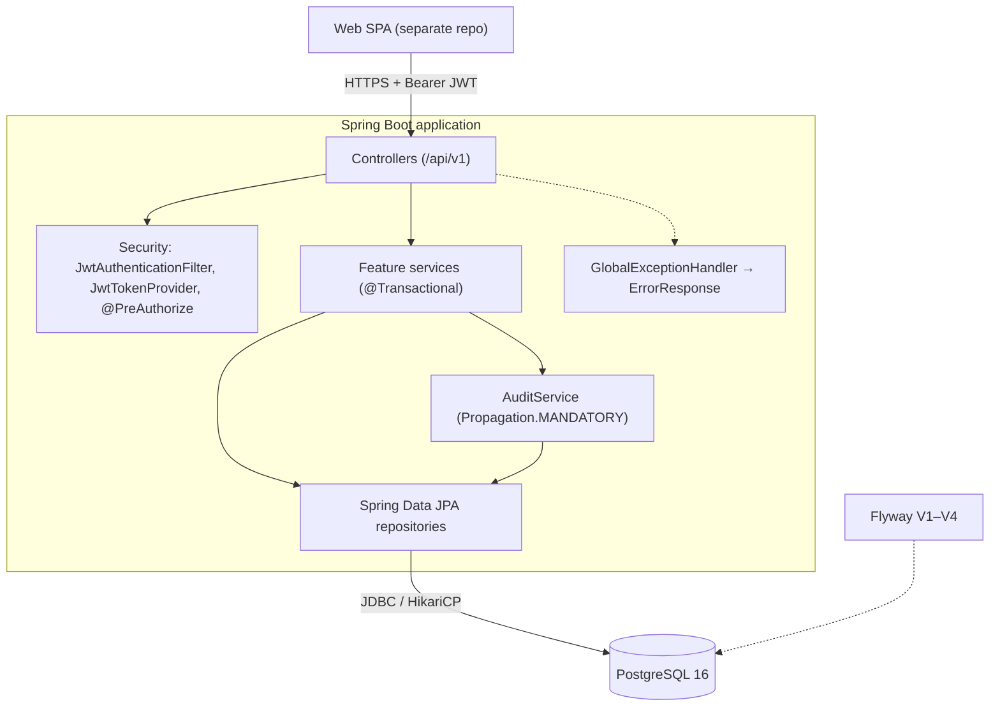

# Architecture Design Document (ADD)
## Student Schedule and Guidance Management System — Backend

| Item | Value |
|---|---|
| Author | Group 2 |
| Version | 1.0 |
| Status | Draft for review |
| Last updated | 2026-09-24 |
| Previous documents | `01-BRD.md`, `02-PRD.md`, `03-Event-Storming.md` |
| Related | `docs/erd.mmd`, `docs/c4/workspace.dsl`, `docs/feature-list-and-architecture.md` |

This document describes the architecture **as built** in this repository (Flyway V1–V4, 28 integration tests passing on the last run of 2026-09-22) and the **planned** additions needed to close the gaps listed in the PRD. Status: ✅ in use · 🟡 partial · ⚪ planned.

---

## 1. Technology Stack

Versions below are pinned from `pom.xml`, `Dockerfile`, `docker-compose.yml` and the resolved test classpath.

### 1.1 In use
| ID | Category | Selected | Pinned version | Alternatives considered | Rationale |
|---|---|---|---|---|---|
| TS-01 | Language / runtime | Java (Eclipse Temurin) | 17 (`maven:3.9.9-eclipse-temurin-17`, `eclipse-temurin:17-jre-alpine`) | Java 21, Kotlin, .NET | Team skill (C-003); LTS; required minimum for Spring Boot 3. |
| TS-02 | Application framework | Spring Boot | 3.3.4 (Spring Framework 6.1.13) | Quarkus, NestJS, ASP.NET Core | Auto-configuration, large ecosystem, fits a layered REST monolith. See ADR-011 on support status. |
| TS-03 | Web / server | Spring MVC on embedded Tomcat | Tomcat 10.1.30 | WebFlux | Simple blocking model is enough for the expected load. |
| TS-04 | Security | Spring Security (stateless) | 6.3.3 | Session cookies, Keycloak | RBAC with `@PreAuthorize`, stateless API for a SPA. |
| TS-05 | Token | JJWT (api / impl / jackson) | 0.12.6 | Spring OAuth2 Resource Server, Auth0 java-jwt | Simple self-issued access tokens; easy to plug Google SSO later (ADR-004). |
| TS-06 | Persistence | Spring Data JPA / Hibernate ORM | Spring Data JPA 3.3.4 / Hibernate 6.5.3.Final | jOOQ, MyBatis | Entity mapping, pessimistic locking (`@Lock`) for bookings. |
| TS-07 | Validation | Hibernate Validator (Bean Validation) | 8.0.1.Final | Manual checks | Declarative request validation (`@NotBlank`, `@Min`, `@Future`). |
| TS-08 | Database | PostgreSQL | 16 (`postgres:16-alpine`), JDBC driver 42.7.4 | MySQL 8, SQL Server | Row locks (`SELECT … FOR UPDATE`), check constraints, free (ADR-002). |
| TS-09 | Connection pool | HikariCP | 5.1.0 (max 15, min idle 5) | — | Default in Spring Boot; small pool on purpose (ADR-003). |
| TS-10 | Schema migration | Flyway | 10.10.0 (+ `flyway-database-postgresql`) | Liquibase, Hibernate DDL | Versioned SQL owned by the team; Hibernate only validates (ADR-002). |
| TS-11 | JSON | Jackson | 2.17.2 | Gson | Spring default; `non_null` inclusion, UTC time zone. |
| TS-12 | API documentation | springdoc-openapi (Swagger UI) | 2.6.0 (Swagger UI 5.17.14) | Hand-written OpenAPI | Contract generated from code at `/v3/api-docs`, UI at `/swagger-ui.html`. |
| TS-13 | Boilerplate | Lombok | 1.18.48 | Java records only | Less boilerplate on JPA entities. |
| TS-14 | Testing | JUnit 5 + MockMvc + Spring Security Test + Mockito | JUnit 5.10.3, Mockito 5.11.0 | TestNG | Integration tests of full HTTP flows per sprint. |
| TS-15 | Test database | H2 (profile `test`) | 2.2.224 | Testcontainers PostgreSQL | Tests run without Docker; see ADR-010 for its limits. |
| TS-16 | Build | Maven | 3.9.9 | Gradle | Standard with IntelliJ IDEA. |
| TS-17 | Packaging / run | Docker multi-stage image + Docker Compose | Compose file with `app` + `postgres` | Bare VM | Same environment for everyone; non-root `spring` user. |

### 1.2 Planned (to close PRD gaps)
| ID | Category | Candidate | For | Notes |
|---|---|---|---|---|
| TS-18 | E-mail | `spring-boot-starter-mail` (SMTP / transactional provider) | FR-003, DEP-001 | Version managed by Spring Boot BOM. |
| TS-19 | SSO | `spring-boot-starter-oauth2-client` (Google, `hd=fpt.edu.vn`) | FR-010.6, A-005 | Exchange Google identity for the existing JWT. |
| TS-20 | Health / metrics | `spring-boot-starter-actuator` | NFR-003 | `/actuator/health` is already public in `SecurityConfig` but the dependency is missing. |
| TS-21 | Scheduling | Spring `@Scheduled` (+ ShedLock if more than one instance) | POL-16…20, POL-23 | Reminders, deadlines, no-show marking. |
| TS-22 | File storage | S3-compatible object storage (MinIO locally) | FR-004.5, FR-005.6, FR-007.9 | Replace client-supplied `fileUrl` with upload + presigned URL. |
| TS-23 | Minutes generation | OpenAI-compatible LLM client behind `MinutesGenerator` | FR-007.4, DEP-004 | Keep the current template as fallback (ADR-006). |
| TS-24 | Excel/CSV | Apache POI / OpenCSV | FR-009.6, FR-010.9 | Export reports, import accounts. |
| TS-25 | Real-DB tests | Testcontainers PostgreSQL | NFR-002, NFR-013 | Exercise real row locks. |
| TS-26 | Load test | k6 | NFR-001, NFR-002 | ≥ 50 concurrent bookings on one slot. |
| TS-27 | Frontend | Separate SPA repository (framework to be confirmed) | NFR-005, NFR-008 | Calendly-style grid; responsive. |

---

## 2. Domain Entities

Physical schema: `src/main/resources/db/migration/V1…V4`; diagram: `docs/erd.mmd`. All tables use `UUID` primary keys and `created_at` / `updated_at` (JPA auditing, `BaseEntity`), except the append-only audit table.

| Entity (table) | Aggregate | Key fields | Relationships | Constraints | Lifecycle | Classification |
|---|---|---|---|---|---|---|
| User (`users`) | AGG-01 | email, full_name, password_hash, role, status, avatar_url | 1-n GroupMember, ScheduleSlot, EvaluationRecord, Topic (admin) | email UNIQUE; role ∈ {ADMIN, INSTRUCTOR, GROUP_LEADER, STUDENT}; status ∈ {ACTIVE, SUSPENDED, INACTIVE} | ACTIVE → SUSPENDED → INACTIVE | Internal Confidential |
| StudentGroup (`student_groups`) | AGG-02 | group_code, topic_id (nullable), supervisor_id (nullable), semester, status | n-1 Topic, n-1 User (supervisor); 1-n GroupMember, Booking, RequirementLog, EvaluationRecord, ArtifactSubmission | group_code UNIQUE; status ∈ {FORMED, ACTIVE, COMPLETED, ARCHIVED} | FORMED → ACTIVE → COMPLETED → ARCHIVED | Internal |
| GroupMember (`group_members`) | AGG-02 | group_id, user_id, is_leader, joined_at, status | n-1 StudentGroup, n-1 User | UNIQUE (group_id, user_id); status ∈ {ACTIVE, REMOVED}; ≤ 5 active & 1 leader per group (service) | ACTIVE → REMOVED | Internal |
| Topic (`topics`) | AGG-03 | topic_code, title, description, category, admin_id, status | 1-n StudentGroup, QuestionBankItem | topic_code UNIQUE; status ∈ {DRAFT, PUBLISHED, ARCHIVED} | DRAFT → PUBLISHED → ARCHIVED | Public Internal |
| QuestionBankItem (`question_bank_items`) | AGG-04 | topic_id, category, question_text, guidance_notes, created_by, status | n-1 Topic, n-1 User | status ∈ {DRAFT, ACTIVE, DEPRECATED} | DRAFT → ACTIVE → DEPRECATED | Public Internal |
| ScheduleSlot (`schedule_slots`) | AGG-05 | instructor_id, start_time, end_time, duration_minutes, capacity_groups, booked_count, location_type, meeting_url, status | n-1 User; 1-n Booking | end_time > start_time; 0 ≤ booked_count ≤ capacity_groups; location_type ∈ {ONLINE, OFFLINE}; index (instructor_id, status, start_time) | AVAILABLE ⇄ FULL → IN_SESSION → COMPLETED; → CANCELLED | Internal |
| Booking (`bookings`) | AGG-06 | slot_id, group_id, booking_status, booked_at, notes, cancelled_at | n-1 ScheduleSlot, n-1 StudentGroup; 1-1 MeetingSession | booking_status ∈ {CONFIRMED, ATTENDED, CANCELLED, NO_SHOW}; index (group_id, booking_status) | CONFIRMED → ATTENDED / NO_SHOW / CANCELLED | Internal |
| MeetingSession (`meeting_sessions`) | AGG-08 | booking_id, started_at, ended_at, raw_notes, session_status | 1-1 Booking; 1-n RequirementLog, ArtifactSubmission; 1-1 MeetingMinute | booking_id UNIQUE; status ∈ {SCHEDULED, IN_PROGRESS, CONCLUDED} | SCHEDULED → IN_PROGRESS → CONCLUDED | Internal |
| RequirementLog (`requirement_logs`) | AGG-09 | session_id, group_id, title, description, priority, status, assigned_to | n-1 MeetingSession, StudentGroup, User | priority ∈ {HIGH, MEDIUM, LOW}; status ∈ {OPEN, IN_PROGRESS, RESOLVED, CLOSED} | OPEN → IN_PROGRESS → RESOLVED → CLOSED | Internal |
| MeetingMinute (`meeting_minutes`) | AGG-10 | session_id, generated_content, final_content, status, student_signed_at, instructor_signed_at | 1-1 MeetingSession | session_id UNIQUE; status ∈ {DRAFT, UNDER_REVIEW, APPROVED, REJECTED} | DRAFT → UNDER_REVIEW → APPROVED / REJECTED | Internal Confidential |
| EvaluationRecord (`evaluation_records`) | AGG-11 | group_id, instructor_id, topic_fit_score, product_quality_score, communication_score, total_score, feedback_notes, evaluated_at, status | n-1 StudentGroup, n-1 User | each score 0–100; status ∈ {DRAFT, SUBMITTED, PUBLISHED} | created PUBLISHED (ADR-008) | Restricted Confidential |
| ArtifactSubmission (`artifact_submissions`) | AGG-07 | group_id, session_id (nullable), title, file_url, file_type, version, submitted_at, status | n-1 StudentGroup, n-1 MeetingSession | status ∈ {SUBMITTED, SUPERCEDED, ACCEPTED} | SUBMITTED → SUPERCEDED / ACCEPTED | Internal |
| SystemAuditTrail (`system_audit_trail`) | AGG-12 | entity_name, entity_id, action, performed_by, performed_at, details_json | n-1 User | action ∈ {CREATE, UPDATE, CANCEL, APPROVE, REJECT, SIGN}; append-only | — | Internal Confidential |

### 2.1 Planned schema changes (next Flyway versions)
| Change | Reason | PRD |
|---|---|---|
| `session_attendance (session_id, user_id, status PRESENT/LATE/ABSENT)` | Real attendance rate | FR-007.10, FR-009.1 |
| `requirement_logs.code` (e.g. `REQ-012`, unique per group), `due_date`; `assigned_to` NOT NULL | Stable ID, mandatory owner/deadline | FR-006.4, FR-006.5 |
| `assessment_rounds (id, semester, name, start_date, end_date)` + `bookings.round_id`, `schedule_slots.round_id`; partial unique index `(group_id, round_id) WHERE booking_status = 'CONFIRMED'` | One active booking per round at DB level | FR-002.3, OQ-003 |
| `evaluation_weights (course/semester, topic_fit, product_quality, communication)` with sum = 100 | Configurable weights | FR-008.3, A-004 |
| Per-dimension comment columns on `evaluation_records` | Separate feedback per criterion | FR-008.7 |
| `meeting_minutes.review_comments`, `due_at` | Keep rejection comments; 48 h deadline | FR-007.6, FR-007.7 |
| `notifications (recipient_id, type, channel, payload, status, read_at)` | In-app notifications and e-mail retries | FR-003 |
| `topic_materials (topic_id, title, file_key)` | Reference materials | FR-005.6 |
| Role `DEPT_HEAD` in the `users.role` check constraint | ST-005 read-only reports | FR-009.2 |

---

## 3. Architecture Components

### 3.1 Style
Layered monolith, **package-by-feature** (`com.capstone.tracking.<feature>`), one deployable Spring Boot application exposing a REST API under `/api/v1`, one PostgreSQL database (ADR-001). Each feature package follows the same shape: `Controller` (HTTP, RBAC) → `Service` (`@Transactional`, business rules, audit) → `Repository` (Spring Data JPA) → `Entity`, with request/response DTOs in `dto/`.



### 3.2 Components
| ID | Component (package) | Responsibility | Aggregates | Depends on | PRD | Status |
|---|---|---|---|---|---|---|
| COMP-01 | `auth` | Register (domain-restricted), login, current user; issue JWT. | User | `user`, `security` | FR-010 | ✅ |
| COMP-02 | `user` | Admin user management, roles, status. | User | — | FR-010 | ✅ |
| COMP-03 | `security` + `config.SecurityConfig` | JWT filter, token provider, user details, CORS, stateless session, public endpoints, method security. | — | `user` | FR-010.7 | ✅ |
| COMP-04 | `group` | Groups, members, leader, self-create / self-join, 5-member limit. | StudentGroup | `topic`, `user` | FR-011 | ✅ |
| COMP-05 | `topic` | Topic catalogue. | Topic | — | FR-005 | ✅ |
| COMP-06 | `question` | Question bank per topic. | QuestionBankItem | `topic` | FR-005 | 🟡 |
| COMP-07 | `scheduling` | Slots (overlap rule), bookings with pessimistic lock, late-cancellation rule. | ScheduleSlot, Booking | `group`, `audit` | FR-001, FR-002 | 🟡 |
| COMP-08 | `artifact` | Versioned artifact submissions and acceptance. | ArtifactSubmission | `group`, `meeting`, `audit` | FR-004 | 🟡 |
| COMP-09 | `meeting` | Sessions, requirement logs, minutes generation (template) and two-party sign-off. | MeetingSession, RequirementLog, MeetingMinute | `scheduling`, `group`, `audit` | FR-006, FR-007 | 🟡 |
| COMP-10 | `evaluation` | Three-dimension scoring, weighted total, visibility of published records. | EvaluationRecord | `group`, `audit` | FR-008 | 🟡 |
| COMP-11 | `report` | Semester / ISO-week summary computed on request. | read model | `meeting` repositories | FR-009 | 🟡 |
| COMP-12 | `audit` | Append-only audit record inside the caller's transaction. | SystemAuditTrail | — | FR-012 | 🟡 |
| COMP-13 | `common` | `BaseEntity`, exceptions, `GlobalExceptionHandler`, `ErrorResponse`. | — | — | — | ✅ |
| COMP-14 | `config` | Security, JPA auditing, OpenAPI configuration. | — | — | — | ✅ |
| COMP-15 | `notification` *(planned)* | Listen to domain events (`ApplicationEventPublisher`, `@TransactionalEventListener(AFTER_COMMIT)`), send e-mail, store in-app messages, retry. | Notification | TS-18 | FR-003 | ⚪ |
| COMP-16 | `scheduler` *(planned)* | Reminders, 48 h minutes deadline, artifact lock, no-show marking. | — | TS-21 | POL-16…20, 23 | ⚪ |
| COMP-17 | `storage` *(planned)* | `FileStorage` port: upload, presigned download, size/type checks. | — | TS-22 | FR-004.5 | ⚪ |
| COMP-18 | `minutes.generator` *(planned)* | `MinutesGenerator` port: `TemplateMinutesGenerator` (current logic) and `LlmMinutesGenerator`. | — | TS-23 | FR-007.4 | ⚪ |
| COMP-19 | `security.ownership` *(planned)* | `@groupSecurity.isLeaderOf(#groupId)`, `isMemberOf`, `isSupervisorOf`, `ownsSlot` for `@PreAuthorize`. | — | `group`, `scheduling` | FR-010.8 | ⚪ |

### 3.3 Request flow
1. Client sends `Authorization: Bearer <JWT>`.
2. `JwtAuthenticationFilter` validates the token, loads the user, fills the `SecurityContext` (stateless, no cookies, CSRF disabled).
3. `@PreAuthorize` checks the role; Bean Validation checks the body.
4. The service validates business rules, changes entities and calls `auditService.record(...)` in the same transaction.
5. Hibernate flushes to PostgreSQL (`ddl-auto: validate`); Jackson returns a DTO; errors become `ErrorResponse`.

### 3.4 Deployment view
Docker Compose with two containers: `app` (Spring Boot on port 8080, non-root user) and `postgres` (16-alpine, port 5432). Flyway migrates on start-up. Configuration through environment variables: `DB_URL`, `DB_USERNAME`, `DB_PASSWORD`, `DB_POOL_MAX/MIN`, `JWT_SECRET`, `JWT_ACCESS_EXP_MIN`, `JWT_REFRESH_EXP_DAYS`, `CORS_ALLOWED_ORIGINS`, `ALLOWED_EMAIL_DOMAIN`, `SERVER_PORT`. TLS termination is expected at a reverse proxy in front of `app` (NFR-004).

---

## 4. Interface Contracts

### 4.1 Conventions
- **Base path** `/api/v1`; OpenAPI at `/v3/api-docs`, Swagger UI at `/swagger-ui.html`.
- **Public endpoints:** `POST /auth/register`, `POST /auth/login`, Swagger, `/actuator/health`. Everything else requires `Authorization: Bearer <access token>`.
- **Format:** JSON; timestamps ISO-8601 UTC (`Instant`); null fields omitted; IDs are UUID.
- **Paging:** list endpoints accept Spring `Pageable` (`?page=0&size=20&sort=field,asc`) and return a Spring `Page`.
- **Errors** (`ErrorResponse`):
  ```json
  { "timestamp": "2026-10-01T08:00:00Z", "status": 409, "errorCode": "CONFLICT",
    "message": "Slot … is already full", "path": "/api/v1/slots/…/book",
    "fieldErrors": [ { "field": "capacity", "message": "must be greater than or equal to 1" } ] }
  ```
  `fieldErrors` only on validation failures (`errorCode = VALIDATION_FAILED`).
- **Status codes:** 200/201 (with `Location`) success · 204 delete · 400 validation or business rule (e.g. already booked, late cancellation, empty notes) · 401 invalid credentials / missing token · 403 wrong role or not a group member · 404 not found (also hides unpublished evaluations) · 405 method not allowed · 409 conflict (overlap, full slot, duplicate code/e-mail, group full, wrong minutes state) · 500 unexpected.

### 4.2 REST endpoints
Blueprint IDs `API-001…011` are kept; `API-012+` are new.

| ID | Method & path | Roles | Request | Response | Errors | FR | Status |
|---|---|---|---|---|---|---|---|
| API-001 | `POST /slots` | INSTRUCTOR, ADMIN | `startTime`, `endTime` (future), `durationMinutes` ≥ 5, `capacity` ≥ 1, `locationType` ONLINE/OFFLINE, `meetingUrl` | 201 `SlotResponse` | 400, 409 overlap | FR-001.1–2 | ✅ |
| API-002 | `GET /slots?instructorId&status&fromDate&toDate` | all | query + paging | `Page<SlotResponse>` (capacity, bookedCount) | 400 | FR-001.7 | ✅ |
| API-003 | `POST /slots/{id}/book` | GROUP_LEADER | `groupId`, `notes` | 200 `BookingResponse` (status CONFIRMED) | 400 already booked, 404, 409 full | FR-002.1–5 | ✅ (ownership ⚪) |
| API-004 | `DELETE /bookings/{id}` | GROUP_LEADER, INSTRUCTOR, ADMIN | `reason` (required) | 200 `{ "message": "Cancelled" }` | 400 late / not confirmed, 404 | FR-002.6 | ✅ (ownership ⚪) |
| API-005 | `POST /groups/{groupId}/artifacts` | STUDENT, GROUP_LEADER (members) | `title`, `fileUrl`, `fileType`, `sessionId?` | 201 `ArtifactResponse` (version, status) | 400, 403, 404 | FR-004.1–2 | ✅ (multipart ⚪) |
| API-006 | `GET /topics/{topicId}/questions?category` | all | paging | `Page<QuestionResponse>` | 404 topic | FR-005.4 | ✅ |
| API-007 | `POST /meetings/{id}/requirements` | GROUP_LEADER, INSTRUCTOR | `title`, `description`, `priority` | 201 `RequirementResponse` (status OPEN) | 400, 403, 404 | FR-006.1 | ✅ |
| API-008 | `POST /meetings/{id}/minutes/generate` | GROUP_LEADER, INSTRUCTOR | `notes?` (defaults to session raw notes) | 200 `{ minuteDraft, generatedSections }` | 400 empty notes / already submitted, 403, 404 | FR-007.3 | ✅ |
| API-009 | `PUT /meetings/{id}/minutes/sign` | GROUP_LEADER (submit), INSTRUCTOR/ADMIN (decide) | `decision` APPROVE/REJECT, `comments?`, `finalContent?` | 200 `MinuteResponse` (status) | 403, 404, 409 wrong state | FR-007.5–6 | ✅ |
| API-010 | `POST /groups/{groupId}/evaluations` | INSTRUCTOR | `topicFitScore`, `productQualityScore`, `communicationScore` (0–100), `feedback` | 201 `EvaluationResponse` (totalScore, PUBLISHED) | 400, 404 | FR-008.1–4 | ✅ (supervisor check ⚪) |
| API-011 | `GET /reports/summary?semester&weekNumber` | ADMIN | query | `{ sessionsHeld, attendanceRate, openReqs, closedReqs }` | 403 | FR-009.1 | ✅ |
| API-014 | `GET /slots/{id}` | all | — | `SlotResponse` | 404 | FR-001.7 | ✅ |
| API-018 | `GET /groups/{groupId}/artifacts` | all | paging | `Page<ArtifactResponse>` | 404 | FR-004.3 | ✅ |
| API-019 | `GET /artifacts/{id}` | all | — | `ArtifactResponse` | 404 | FR-004.3 | ✅ |
| API-020 | `POST /artifacts/{id}/accept` | INSTRUCTOR, ADMIN | — | `ArtifactResponse` (ACCEPTED) | 400 not submitted, 404 | FR-004.4 | ✅ |
| API-021 | `POST /topics` | ADMIN | `topicCode`, `title`, `description`, `category` | 201 `TopicResponse` (DRAFT) | 409 code | FR-005.1 | ✅ |
| API-022 | `PUT /topics/{id}` | ADMIN | `title`, `description`, `category`, `status` | `TopicResponse` | 404 | FR-005.1 | ✅ |
| API-023 | `GET /topics?status` | all | paging | `Page<TopicResponse>` | — | FR-005.2 | ✅ |
| API-024 | `GET /topics/{id}` | all | — | `TopicResponse` | 404 | FR-005.2 | ✅ |
| API-025 | `POST /topics/{topicId}/questions` | ADMIN | `category`, `questionText`, `guidanceNotes` | 201 `QuestionResponse` (DRAFT) | 404 | FR-005.3 | ✅ |
| API-028 | `GET /meetings/{id}/requirements` | all authenticated (membership not checked on read) | paging | `Page<RequirementResponse>` | 404 | FR-006.6 | ✅ |
| API-029 | `PUT /requirements/{id}` | GROUP_LEADER, INSTRUCTOR | `status?`, `assignedTo?` | `RequirementResponse` | 403, 404 | FR-006.3 | ✅ |
| API-030 | `POST /bookings/{bookingId}/meetings` | GROUP_LEADER, INSTRUCTOR | — | 201 `MeetingSessionResponse` (SCHEDULED) | 400 not confirmed, 403, 409 exists | FR-007.1 | ✅ |
| API-031 | `GET /meetings/{id}` | all | — | `MeetingSessionResponse` | 404 | FR-007.12 | ✅ |
| API-032 | `PUT /meetings/{id}/start` | GROUP_LEADER, INSTRUCTOR | — | `MeetingSessionResponse` (IN_PROGRESS) | 400 wrong state, 403 | FR-007.2 | ✅ |
| API-033 | `PUT /meetings/{id}/end` | GROUP_LEADER, INSTRUCTOR | `rawNotes?` | `MeetingSessionResponse` (CONCLUDED) | 400 wrong state, 403 | FR-007.2 | ✅ |
| API-037 | `GET /groups/{groupId}/evaluations` | all (students see PUBLISHED only) | paging | `Page<EvaluationResponse>` | 404 | FR-008.5 | ✅ |
| API-038 | `GET /evaluations/{id}` | all (students: PUBLISHED only) | — | `EvaluationResponse` | 404 | FR-008.5 | ✅ |
| API-042 | `POST /auth/register` | public | `email`, `fullName`, `password` ≥ 8 | `LoginResponse` (token, expiresIn, user) | 400 domain, 409 e-mail | FR-010.1 | ✅ |
| API-043 | `POST /auth/login` | public | `email`, `password` | `LoginResponse` | 401 | FR-010.2 | ✅ |
| API-045 | `GET /auth/me` | authenticated | — | `UserResponse` | 401 | FR-010.4 | ✅ |
| API-046 | `POST /users` | ADMIN | `email`, `fullName`, `password`, `role` | 201 `UserResponse` | 409 e-mail | FR-010.5 | ✅ |
| API-047 | `GET /users?role` | ADMIN, INSTRUCTOR, GROUP_LEADER | paging | `Page<UserResponse>` | — | FR-010.5 | ✅ |
| API-048 | `GET /users/{id}` | ADMIN, INSTRUCTOR, GROUP_LEADER | — | `UserResponse` | 404 | FR-010.5 | ✅ |
| API-049 | `PUT /users/{id}` | ADMIN | `fullName`, `avatarUrl`, `status` | `UserResponse` | 404 | FR-010.5 | ✅ |
| API-052 | `POST /groups` | ADMIN, INSTRUCTOR, STUDENT | `groupCode`, `semester`, `topicId?`, `supervisorId?` | 201 `StudentGroupResponse` | 400 supervisor role, 409 code / already in group | FR-011.1 | ✅ |
| API-053 | `GET /groups?supervisorId&topicId&available` | all | paging | `Page<StudentGroupResponse>` (memberCount, full) | — | FR-011.6 | ✅ |
| API-054 | `GET /groups/{id}` | all | — | `StudentGroupResponse` with members | 404 | FR-011.6 | ✅ |
| API-055 | `PUT /groups/{id}` | ADMIN, INSTRUCTOR | `topicId?`, `supervisorId?`, `status` | `StudentGroupResponse` | 400, 404 | FR-011.2 | ✅ |
| API-056 | `POST /groups/{id}/join` | STUDENT | — | 201 `GroupMemberResponse` | 409 already in a group / full | FR-011.3 | ✅ |
| API-057 | `POST /groups/{id}/members` | ADMIN, INSTRUCTOR, GROUP_LEADER | `userId`, `isLeader` | 201 `GroupMemberResponse` | 400 role, 409 member / full / leader | FR-011.4 | ✅ |
| API-058 | `DELETE /groups/{id}/members/{memberId}` | ADMIN, INSTRUCTOR, GROUP_LEADER | — | 204 | 404 | FR-011.5 | ✅ |
| API-060 | `GET /meetings/{id}/minutes` | all authenticated (membership not checked on read) | — | `MinuteResponse` | 404 | FR-007.12 | ✅ |

#### Planned endpoints
| ID | Method & path | Roles | Purpose | FR |
|---|---|---|---|---|
| API-012 | `PUT /slots/{id}` | slot owner, ADMIN | Edit slot | FR-001.5 |
| API-013 | `POST /slots/{id}/cancel` | slot owner, ADMIN | Cancel slot and its bookings | FR-001.6 |
| API-015 | `PUT /bookings/{id}/attendance` | INSTRUCTOR | Mark ATTENDED / NO_SHOW | FR-002.9 |
| API-016 | `GET /bookings/{id}/calendar.ics` | participants | Calendar export | FR-003.6 |
| API-017 | `GET /notifications`, `PUT /notifications/{id}/read` | all | In-app notifications | FR-003.7 |
| API-026 | `PUT /questions/{id}` | ADMIN | Edit / activate / deprecate question | FR-005.5 |
| API-027 | `POST/GET /topics/{id}/materials` | ADMIN / all | Reference materials | FR-005.6 |
| API-034 | `PUT /meetings/{id}/attendance` | INSTRUCTOR | Record attendance | FR-007.10 |
| API-035 | `POST /meetings/{id}/qa` | INSTRUCTOR | Record questions and answers | FR-007.11 |
| API-036 | `PUT /settings/evaluation-weights` | ADMIN | Configure weights | FR-008.3 |
| API-039 | `GET /reports/groups?week&withoutBooking&atRisk` | ADMIN, DEPT_HEAD, INSTRUCTOR | Groups without booking / at risk | FR-009.3, FR-009.5 |
| API-040 | `GET /reports/trend?semester` | ADMIN, DEPT_HEAD | Weekly trend series | FR-009.4 |
| API-041 | `GET /reports/export?format=csv` (or `xlsx`) | ADMIN | Export | FR-009.6 |
| API-044 | `POST /auth/refresh` | authenticated | Renew access token | FR-010.3 |
| API-050 | `GET /oauth2/authorization/google` | public | Google SSO | FR-010.6 |
| API-051 | `POST /admin/import` (multipart) | ADMIN | Bulk import users/groups | FR-010.9 |
| API-059 | `GET /audit?entityName&entityId&from&to` | ADMIN | Search audit trail | FR-012.2 |

### 4.3 Internal ports (planned)
| Port | Operations | Default adapter | Failure handling |
|---|---|---|---|
| `NotificationSender` | `send(recipient, template, model, channel)` | SMTP e-mail + `notifications` table | Status FAILED, retry with back-off (max 3). |
| `MinutesGenerator` | `generate(sessionNotes, requirements, attendees) → sections` | `TemplateMinutesGenerator` (current logic); `LlmMinutesGenerator` later | Timeout → fall back to template (ADR-006). |
| `FileStorage` | `put(file) → key`, `presignedGet(key)` | S3-compatible (MinIO locally) | 413 / 400 on size or type; 503 if storage down. |
| Domain events | `SlotBooked`, `BookingCancelled`, `MinutesSubmitted`, `MinutesApproved`, `MinutesRejected`, `GroupEvaluated` | Spring `ApplicationEventPublisher`, handled `AFTER_COMMIT` | Handler errors never roll back the business transaction. |

---

## 5. Architecture Decisions

| ID | Decision | Context | Alternatives | Consequences | Status |
|---|---|---|---|---|---|
| ADR-001 | Layered monolith, package-by-feature, single REST API. | One-semester student project (C-006); modest load. | Microservices; Spring Modulith | Simple build and deploy; feature boundaries are by convention only. | Accepted |
| ADR-002 | PostgreSQL with Flyway-owned schema; Hibernate `ddl-auto: validate`. | Need strong consistency, check constraints and row locks. | MySQL; Hibernate auto-DDL | Schema changes are reviewed SQL; entity/schema drift fails at start-up. | Accepted |
| ADR-003 | Prevent over-booking with a pessimistic row lock (`SELECT … FOR UPDATE`) on the slot plus a DB check `booked_count ≤ capacity_groups`; small HikariCP pool (15). | NFR-002, R-001: ≥ 50 groups racing for one seat. | Optimistic locking with retry; Redis distributed lock | Correct on one or many app instances sharing one DB; short queueing on hot slots. Redis not needed. | Accepted |
| ADR-004 | Stateless self-issued JWT (JJWT) with RBAC enforced by `@PreAuthorize` on controllers. | SPA client; SSO planned later (A-005). | Server sessions; external IdP only | Permissions visible per endpoint. Resource ownership must be added separately (ADR-012). Refresh token still to be issued. | Accepted |
| ADR-005 | Audit records written by `AuditService` with `Propagation.MANDATORY`, inside the business transaction. | NFR-006: audit and change must commit or roll back together. | Async audit via events; DB triggers | No lost or orphan audit rows; each service must remember to call it (users, topics, groups still missing). | Accepted |
| ADR-006 | Minutes are drafted by a deterministic template now; later an LLM behind a `MinutesGenerator` port, with the template as fallback. The draft always requires human review and two-party sign-off. | A-003; R-002 (poor auto-summaries); no AI service yet. | Call an LLM directly from the service | Works offline and is testable; "70% faster minutes" (BR-003) depends on the future LLM adapter. | Accepted (LLM part proposed) |
| ADR-007 | v1 stores an artifact `fileUrl` provided by the client; no file storage in the backend. | Keep Sprint 3 small. | Upload to S3/MinIO now | No size/type control and links may break; replaced by `FileStorage` (TS-22). | Accepted, to revisit |
| ADR-008 | Evaluations are created directly as `PUBLISHED` ("Save and Publish", UC-004); students only see published records. | UC-004 describes a single action. | Draft → Submitted → Published workflow | Simpler UX; no draft saving for instructors. DRAFT/SUBMITTED states kept for later. | Accepted |
| ADR-009 | Store and serialize all times in UTC (`Instant`, `hibernate.jdbc.time_zone: UTC`); the client converts to UTC+7. | Reminders, cut-offs and week boundaries must be correct. | Local time in DB | No time-zone drift. Report weeks are currently ISO weeks in UTC; switch to Asia/Ho_Chi_Minh (NFR-010). | Accepted |
| ADR-010 | Integration tests run on H2 (profile `test`). | Tests must run without Docker. | Testcontainers PostgreSQL | Fast tests, but H2 does not prove PostgreSQL locking behaviour; add Testcontainers for booking concurrency (TS-25). | Accepted, to extend |
| ADR-011 | Stay on Spring Boot 3.3.4 / Java 17 for this semester; plan an upgrade to a supported Spring Boot line before any real deployment. | Spring Boot 3.3.x and 3.5.x are out of open-source support (3.5 ended 30 Jun 2026); 4.1 is the current line. | Upgrade now | No framework churn mid-project; security patches no longer come for free until upgraded (NFR-014). | Proposed |
| ADR-012 | Add resource-ownership checks as reusable `@PreAuthorize` beans (`isLeaderOf`, `isMemberOf`, `isSupervisorOf`, `ownsSlot`). | Known gap: a leader can book/cancel/add members for any group; any instructor can evaluate any group. | Checks inside each service | One consistent rule set, visible on endpoints. | Proposed |
| ADR-013 | Students may create and join groups themselves (max 5 active members, one leader, one group per student); the global role changes to `GROUP_LEADER` for the leader. | Real class operation; not in the original blueprint. | Admin-only group formation | Less admin work. Because role is global, a user can lead only one group at a time. | Accepted |
| ADR-014 | Side effects (notifications, reminders) will use Spring application events handled after commit, plus a scheduler; no message broker. | FR-003 is Should; small scale. | RabbitMQ / Kafka; transactional outbox | No extra infrastructure; a crash between commit and send can lose a notification (acceptable, reminders re-sent by scheduler). | Proposed |
