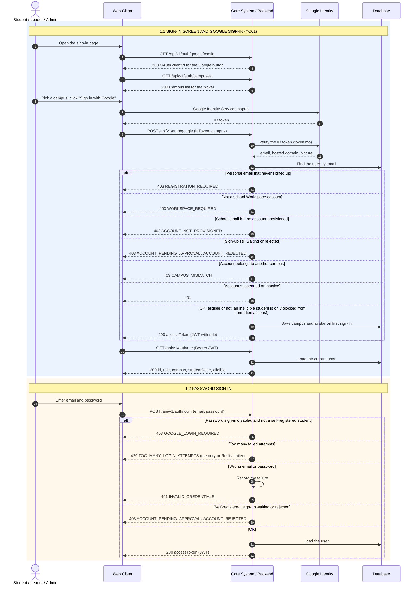
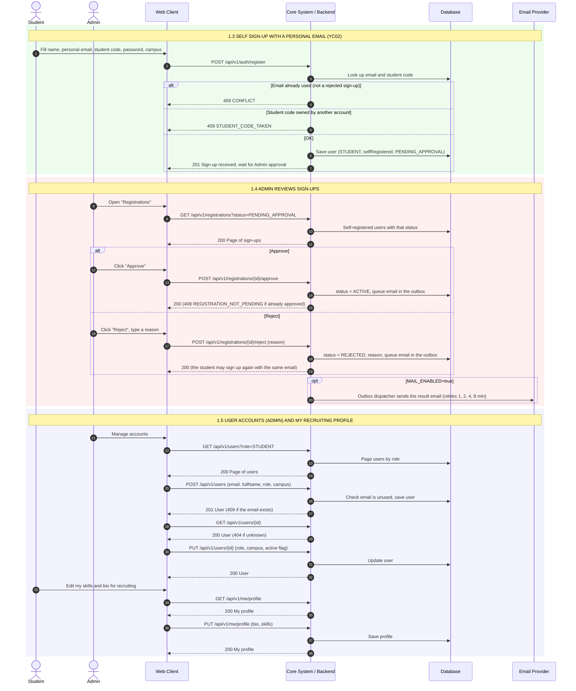

# 1. Đăng nhập, đăng ký và tài khoản

Swagger tag: **Auth** (6), **Registrations** (3), **Users** (6).

```mermaid
sequenceDiagram
    autonumber
    actor U as Student / Leader / Admin
    participant FE as Web Client
    participant BE as Core System / Backend
    participant GG as Google Identity
    participant DB as Database

    rect rgb(235, 243, 255)
    Note over U,DB: 1.1 SIGN-IN SCREEN AND GOOGLE SIGN-IN (YC01)
    U->>FE: Open the sign-in page
    FE->>BE: GET /api/v1/auth/google/config
    BE-->>FE: 200 OAuth clientId for the Google button
    FE->>BE: GET /api/v1/auth/campuses
    BE-->>FE: 200 Campus list for the picker
    U->>FE: Pick a campus, click "Sign in with Google"
    FE->>GG: Google Identity Services popup
    GG-->>FE: ID token
    FE->>BE: POST /api/v1/auth/google (idToken, campus)
    BE->>GG: Verify the ID token (tokeninfo)
    GG-->>BE: email, hosted domain, picture
    BE->>DB: Find the user by email
    alt Personal email that never signed up
        BE-->>FE: 403 REGISTRATION_REQUIRED
    else Not a school Workspace account
        BE-->>FE: 403 WORKSPACE_REQUIRED
    else School email but no account provisioned
        BE-->>FE: 403 ACCOUNT_NOT_PROVISIONED
    else Sign-up still waiting or rejected
        BE-->>FE: 403 ACCOUNT_PENDING_APPROVAL / ACCOUNT_REJECTED
    else Account belongs to another campus
        BE-->>FE: 403 CAMPUS_MISMATCH
    else Account suspended or inactive
        BE-->>FE: 401
    else OK (eligible or not: an ineligible student is only blocked from formation actions)
        BE->>DB: Save campus and avatar on first sign-in
        BE-->>FE: 200 accessToken (JWT with role)
    end
    FE->>BE: GET /api/v1/auth/me (Bearer JWT)
    BE->>DB: Load the current user
    BE-->>FE: 200 id, role, campus, studentCode, eligible
    end

    rect rgb(255, 248, 235)
    Note over U,DB: 1.2 PASSWORD SIGN-IN
    U->>FE: Enter email and password
    FE->>BE: POST /api/v1/auth/login (email, password)
    alt Password sign-in disabled and not a self-registered student
        BE-->>FE: 403 GOOGLE_LOGIN_REQUIRED
    else Too many failed attempts
        BE-->>FE: 429 TOO_MANY_LOGIN_ATTEMPTS (memory or Redis limiter)
    else Wrong email or password
        BE->>BE: Record the failure
        BE-->>FE: 401 INVALID_CREDENTIALS
    else Self-registered, sign-up waiting or rejected
        BE-->>FE: 403 ACCOUNT_PENDING_APPROVAL / ACCOUNT_REJECTED
    else OK
        BE->>DB: Load the user
        BE-->>FE: 200 accessToken (JWT)
    end
    end
```

```mermaid
sequenceDiagram
    autonumber
    actor ST as Student
    actor AD as Admin
    participant FE as Web Client
    participant BE as Core System / Backend
    participant DB as Database
    participant EM as Email Provider

    rect rgb(238, 252, 238)
    Note over ST,EM: 1.3 SELF SIGN-UP WITH A PERSONAL EMAIL (YC02)
    ST->>FE: Fill name, personal email, student code, password, campus
    FE->>BE: POST /api/v1/auth/register
    BE->>DB: Look up email and student code
    alt Email already used (not a rejected sign-up)
        BE-->>FE: 409 CONFLICT
    else Student code owned by another account
        BE-->>FE: 409 STUDENT_CODE_TAKEN
    else OK
        BE->>DB: Save user (STUDENT, selfRegistered, PENDING_APPROVAL)
        BE-->>FE: 201 Sign-up received, wait for Admin approval
    end
    end

    rect rgb(255, 240, 240)
    Note over ST,EM: 1.4 ADMIN REVIEWS SIGN-UPS
    AD->>FE: Open "Registrations"
    FE->>BE: GET /api/v1/registrations?status=PENDING_APPROVAL
    BE->>DB: Self-registered users with that status
    BE-->>FE: 200 Page of sign-ups
    alt Approve
        AD->>FE: Click "Approve"
        FE->>BE: POST /api/v1/registrations/{id}/approve
        BE->>DB: status = ACTIVE, queue email in the outbox
        BE-->>FE: 200 (409 REGISTRATION_NOT_PENDING if already approved)
    else Reject
        AD->>FE: Click "Reject", type a reason
        FE->>BE: POST /api/v1/registrations/{id}/reject (reason)
        BE->>DB: status = REJECTED, reason, queue email in the outbox
        BE-->>FE: 200 (the student may sign up again with the same email)
    end
    opt MAIL_ENABLED=true
        BE->>EM: Outbox dispatcher sends the result email (retries 1, 2, 4, 8 min)
    end
    end

    rect rgb(243, 243, 255)
    Note over ST,EM: 1.5 USER ACCOUNTS (ADMIN) AND MY RECRUITING PROFILE
    AD->>FE: Manage accounts
    FE->>BE: GET /api/v1/users?role=STUDENT
    BE->>DB: Page users by role
    BE-->>FE: 200 Page of users
    FE->>BE: POST /api/v1/users (email, fullName, role, campus)
    BE->>DB: Check email is unused, save user
    BE-->>FE: 201 User (409 if the email exists)
    FE->>BE: GET /api/v1/users/{id}
    BE-->>FE: 200 User (404 if unknown)
    FE->>BE: PUT /api/v1/users/{id} (role, campus, active flag)
    BE->>DB: Update user
    BE-->>FE: 200 User
    ST->>FE: Edit my skills and bio for recruiting
    FE->>BE: GET /api/v1/me/profile
    BE-->>FE: 200 My profile
    FE->>BE: PUT /api/v1/me/profile (bio, skills)
    BE->>DB: Save profile
    BE-->>FE: 200 My profile
    end
```
