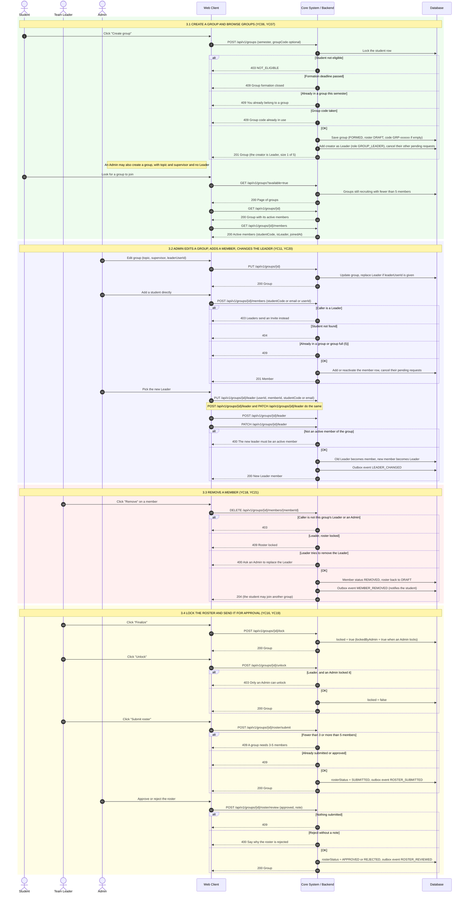

# 3. Nhóm, thành viên, Leader và khoá danh sách

Swagger tag: **Student Groups** (14).

```mermaid
sequenceDiagram
    autonumber
    actor ST as Student
    actor LD as Team Leader
    actor AD as Admin
    participant FE as Web Client
    participant BE as Core System / Backend
    participant DB as Database

    rect rgb(238, 252, 238)
    Note over ST,DB: 3.1 CREATE A GROUP AND BROWSE GROUPS (YC06, YC07)
    ST->>FE: Click "Create group"
    FE->>BE: POST /api/v1/groups (semester, groupCode optional)
    BE->>DB: Lock the student row
    alt Student not eligible
        BE-->>FE: 403 NOT_ELIGIBLE
    else Formation deadline passed
        BE-->>FE: 409 Group formation closed
    else Already in a group this semester
        BE-->>FE: 409 You already belong to a group
    else Group code taken
        BE-->>FE: 409 Group code already in use
    else OK
        BE->>DB: Save group (FORMED, roster DRAFT, code GRP-xxxxxx if empty)
        BE->>DB: Add creator as Leader (role GROUP_LEADER), cancel their other pending requests
        BE-->>FE: 201 Group (the creator is Leader, size 1 of 5)
    end
    Note right of AD: An Admin may also create a group, with topic and supervisor and no Leader
    ST->>FE: Look for a group to join
    FE->>BE: GET /api/v1/groups?available=true
    BE->>DB: Groups still recruiting with fewer than 5 members
    BE-->>FE: 200 Page of groups
    FE->>BE: GET /api/v1/groups/{id}
    BE-->>FE: 200 Group with its active members
    FE->>BE: GET /api/v1/groups/{id}/members
    BE-->>FE: 200 Active members (studentCode, isLeader, joinedAt)
    end

    rect rgb(243, 243, 255)
    Note over ST,DB: 3.2 ADMIN EDITS A GROUP, ADDS A MEMBER, CHANGES THE LEADER (YC11, YC20)
    AD->>FE: Edit group (topic, supervisor, leaderUserId)
    FE->>BE: PUT /api/v1/groups/{id}
    BE->>DB: Update group, replace Leader if leaderUserId is given
    BE-->>FE: 200 Group
    AD->>FE: Add a student directly
    FE->>BE: POST /api/v1/groups/{id}/members (studentCode or email or userId)
    alt Caller is a Leader
        BE-->>FE: 403 Leaders send an Invite instead
    else Student not found
        BE-->>FE: 404
    else Already in a group or group full (5)
        BE-->>FE: 409
    else OK
        BE->>DB: Add or reactivate the member row, cancel their pending requests
        BE-->>FE: 201 Member
    end
    AD->>FE: Pick the new Leader
    FE->>BE: PUT /api/v1/groups/{id}/leader (userId, memberId, studentCode or email)
    Note over FE,BE: POST /api/v1/groups/{id}/leader and PATCH /api/v1/groups/{id}/leader do the same
    FE->>BE: POST /api/v1/groups/{id}/leader
    FE->>BE: PATCH /api/v1/groups/{id}/leader
    alt Not an active member of the group
        BE-->>FE: 400 The new leader must be an active member
    else OK
        BE->>DB: Old Leader becomes member, new member becomes Leader
        BE->>DB: Outbox event LEADER_CHANGED
        BE-->>FE: 200 New Leader member
    end
    end

    rect rgb(255, 240, 240)
    Note over ST,DB: 3.3 REMOVE A MEMBER (YC18, YC21)
    LD->>FE: Click "Remove" on a member
    FE->>BE: DELETE /api/v1/groups/{id}/members/{memberId}
    alt Caller is not this group's Leader or an Admin
        BE-->>FE: 403
    else Leader, roster locked
        BE-->>FE: 409 Roster locked
    else Leader tries to remove the Leader
        BE-->>FE: 400 Ask an Admin to replace the Leader
    else OK
        BE->>DB: Member status REMOVED, roster back to DRAFT
        BE->>DB: Outbox event MEMBER_REMOVED (notifies the student)
        BE-->>FE: 204 (the student may join another group)
    end
    end

    rect rgb(255, 253, 230)
    Note over ST,DB: 3.4 LOCK THE ROSTER AND SEND IT FOR APPROVAL (YC16, YC19)
    LD->>FE: Click "Finalize"
    FE->>BE: POST /api/v1/groups/{id}/lock
    BE->>DB: locked = true (lockedByAdmin = true when an Admin locks)
    BE-->>FE: 200 Group
    LD->>FE: Click "Unlock"
    FE->>BE: POST /api/v1/groups/{id}/unlock
    alt Leader, and an Admin locked it
        BE-->>FE: 403 Only an Admin can unlock
    else OK
        BE->>DB: locked = false
        BE-->>FE: 200 Group
    end
    LD->>FE: Click "Submit roster"
    FE->>BE: POST /api/v1/groups/{id}/roster/submit
    alt Fewer than 3 or more than 5 members
        BE-->>FE: 409 A group needs 3-5 members
    else Already submitted or approved
        BE-->>FE: 409
    else OK
        BE->>DB: rosterStatus = SUBMITTED, outbox event ROSTER_SUBMITTED
        BE-->>FE: 200 Group
    end
    AD->>FE: Approve or reject the roster
    FE->>BE: POST /api/v1/groups/{id}/roster/review (approved, note)
    alt Nothing submitted
        BE-->>FE: 409
    else Reject without a note
        BE-->>FE: 400 Say why the roster is rejected
    else OK
        BE->>DB: rosterStatus = APPROVED or REJECTED, outbox event ROSTER_REVIEWED
        BE-->>FE: 200 Group
    end
    end
```
