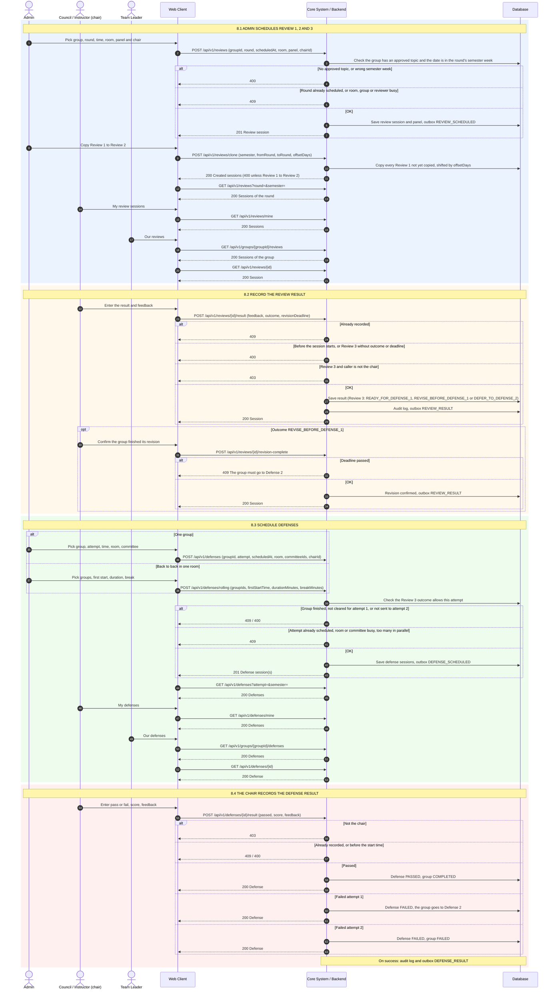

# 8. Review 1, 2, 3 và bảo vệ

Swagger tag: **Reviews** (8), **Defenses** (7).

> Phần này dùng vai trò Instructor và Council, nằm ngoài phạm vi 3 vai trò của đợt lập nhóm.

```mermaid
sequenceDiagram
    autonumber
    actor AD as Admin
    actor CO as Council / Instructor (chair)
    actor LD as Team Leader
    participant FE as Web Client
    participant BE as Core System / Backend
    participant DB as Database

    rect rgb(235, 243, 255)
    Note over AD,DB: 8.1 ADMIN SCHEDULES REVIEW 1, 2 AND 3
    AD->>FE: Pick group, round, time, room, panel and chair
    FE->>BE: POST /api/v1/reviews (groupId, round, scheduledAt, room, panel, chairId)
    BE->>DB: Check the group has an approved topic and the date is in the round's semester week
    alt No approved topic, or wrong semester week
        BE-->>FE: 400
    else Round already scheduled, or room, group or reviewer busy
        BE-->>FE: 409
    else OK
        BE->>DB: Save review session and panel, outbox REVIEW_SCHEDULED
        BE-->>FE: 201 Review session
    end
    AD->>FE: Copy Review 1 to Review 2
    FE->>BE: POST /api/v1/reviews/clone (semester, fromRound, toRound, offsetDays)
    BE->>DB: Copy every Review 1 not yet copied, shifted by offsetDays
    BE-->>FE: 200 Created sessions (400 unless Review 1 to Review 2)
    FE->>BE: GET /api/v1/reviews?round=&semester=
    BE-->>FE: 200 Sessions of the round
    CO->>FE: My review sessions
    FE->>BE: GET /api/v1/reviews/mine
    BE-->>FE: 200 Sessions
    LD->>FE: Our reviews
    FE->>BE: GET /api/v1/groups/{groupId}/reviews
    BE-->>FE: 200 Sessions of the group
    FE->>BE: GET /api/v1/reviews/{id}
    BE-->>FE: 200 Session
    end

    rect rgb(255, 248, 235)
    Note over AD,DB: 8.2 RECORD THE REVIEW RESULT
    CO->>FE: Enter the result and feedback
    FE->>BE: POST /api/v1/reviews/{id}/result (feedback, outcome, revisionDeadline)
    alt Already recorded
        BE-->>FE: 409
    else Before the session starts, or Review 3 without outcome or deadline
        BE-->>FE: 400
    else Review 3 and caller is not the chair
        BE-->>FE: 403
    else OK
        BE->>DB: Save result (Review 3: READY_FOR_DEFENSE_1, REVISE_BEFORE_DEFENSE_1 or DEFER_TO_DEFENSE_2)
        BE->>DB: Audit log, outbox REVIEW_RESULT
        BE-->>FE: 200 Session
    end
    opt Outcome REVISE_BEFORE_DEFENSE_1
        CO->>FE: Confirm the group finished its revision
        FE->>BE: POST /api/v1/reviews/{id}/revision-complete
        alt Deadline passed
            BE-->>FE: 409 The group must go to Defense 2
        else OK
            BE->>DB: Revision confirmed, outbox REVIEW_RESULT
            BE-->>FE: 200 Session
        end
    end
    end

    rect rgb(238, 252, 238)
    Note over AD,DB: 8.3 SCHEDULE DEFENSES
    alt One group
        AD->>FE: Pick group, attempt, time, room, committee
        FE->>BE: POST /api/v1/defenses (groupId, attempt, scheduledAt, room, committeeIds, chairId)
    else Back to back in one room
        AD->>FE: Pick groups, first start, duration, break
        FE->>BE: POST /api/v1/defenses/rolling (groupIds, firstStartTime, durationMinutes, breakMinutes)
    end
    BE->>DB: Check the Review 3 outcome allows this attempt
    alt Group finished, not cleared for attempt 1, or not sent to attempt 2
        BE-->>FE: 409 / 400
    else Attempt already scheduled, room or committee busy, too many in parallel
        BE-->>FE: 409
    else OK
        BE->>DB: Save defense sessions, outbox DEFENSE_SCHEDULED
        BE-->>FE: 201 Defense session(s)
    end
    FE->>BE: GET /api/v1/defenses?attempt=&semester=
    BE-->>FE: 200 Defenses
    CO->>FE: My defenses
    FE->>BE: GET /api/v1/defenses/mine
    BE-->>FE: 200 Defenses
    LD->>FE: Our defenses
    FE->>BE: GET /api/v1/groups/{groupId}/defenses
    BE-->>FE: 200 Defenses
    FE->>BE: GET /api/v1/defenses/{id}
    BE-->>FE: 200 Defense
    end

    rect rgb(255, 240, 240)
    Note over AD,DB: 8.4 THE CHAIR RECORDS THE DEFENSE RESULT
    CO->>FE: Enter pass or fail, score, feedback
    FE->>BE: POST /api/v1/defenses/{id}/result (passed, score, feedback)
    alt Not the chair
        BE-->>FE: 403
    else Already recorded, or before the start time
        BE-->>FE: 409 / 400
    else Passed
        BE->>DB: Defense PASSED, group COMPLETED
        BE-->>FE: 200 Defense
    else Failed attempt 1
        BE->>DB: Defense FAILED, the group goes to Defense 2
        BE-->>FE: 200 Defense
    else Failed attempt 2
        BE->>DB: Defense FAILED, group FAILED
        BE-->>FE: 200 Defense
    end
    Note over BE,DB: On success: audit log and outbox DEFENSE_RESULT
    end
```
