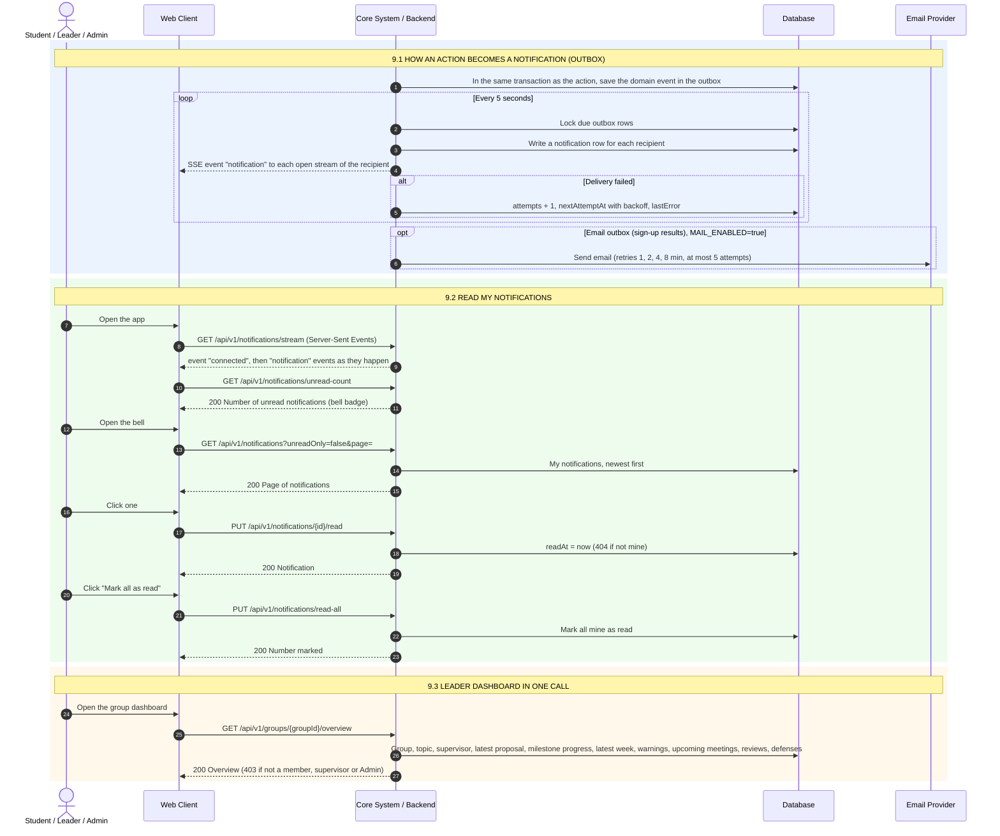
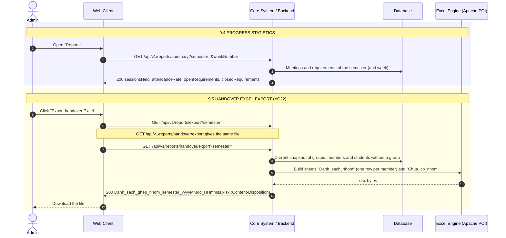

# 9. Thông báo, tổng quan nhóm, thống kê và xuất Excel bàn giao

Swagger tag: **Notifications** (5), **Group Overview** (1), **Reports** (3).

```mermaid
sequenceDiagram
    autonumber
    actor U as Student / Leader / Admin
    participant FE as Web Client
    participant BE as Core System / Backend
    participant DB as Database
    participant EM as Email Provider

    rect rgb(235, 243, 255)
    Note over U,EM: 9.1 HOW AN ACTION BECOMES A NOTIFICATION (OUTBOX)
    BE->>DB: In the same transaction as the action, save the domain event in the outbox
    loop Every 5 seconds
        BE->>DB: Lock due outbox rows
        BE->>DB: Write a notification row for each recipient
        BE-->>FE: SSE event "notification" to each open stream of the recipient
        alt Delivery failed
            BE->>DB: attempts + 1, nextAttemptAt with backoff, lastError
        end
    end
    opt Email outbox (sign-up results), MAIL_ENABLED=true
        BE->>EM: Send email (retries 1, 2, 4, 8 min, at most 5 attempts)
    end
    end

    rect rgb(238, 252, 238)
    Note over U,EM: 9.2 READ MY NOTIFICATIONS
    U->>FE: Open the app
    FE->>BE: GET /api/v1/notifications/stream (Server-Sent Events)
    BE-->>FE: event "connected", then "notification" events as they happen
    FE->>BE: GET /api/v1/notifications/unread-count
    BE-->>FE: 200 Number of unread notifications (bell badge)
    U->>FE: Open the bell
    FE->>BE: GET /api/v1/notifications?unreadOnly=false&page=
    BE->>DB: My notifications, newest first
    BE-->>FE: 200 Page of notifications
    U->>FE: Click one
    FE->>BE: PUT /api/v1/notifications/{id}/read
    BE->>DB: readAt = now (404 if not mine)
    BE-->>FE: 200 Notification
    U->>FE: Click "Mark all as read"
    FE->>BE: PUT /api/v1/notifications/read-all
    BE->>DB: Mark all mine as read
    BE-->>FE: 200 Number marked
    end

    rect rgb(255, 248, 235)
    Note over U,EM: 9.3 LEADER DASHBOARD IN ONE CALL
    U->>FE: Open the group dashboard
    FE->>BE: GET /api/v1/groups/{groupId}/overview
    BE->>DB: Group, topic, supervisor, latest proposal, milestone progress, latest week, warnings, upcoming meetings, reviews, defenses
    BE-->>FE: 200 Overview (403 if not a member, supervisor or Admin)
    end
```

```mermaid
sequenceDiagram
    autonumber
    actor AD as Admin
    participant FE as Web Client
    participant BE as Core System / Backend
    participant DB as Database
    participant XL as Excel Engine (Apache POI)

    rect rgb(243, 243, 255)
    Note over AD,XL: 9.4 PROGRESS STATISTICS
    AD->>FE: Open "Reports"
    FE->>BE: GET /api/v1/reports/summary?semester=&weekNumber=
    BE->>DB: Meetings and requirements of the semester (and week)
    BE-->>FE: 200 sessionsHeld, attendanceRate, openRequirements, closedRequirements
    end

    rect rgb(255, 253, 230)
    Note over AD,XL: 9.5 HANDOVER EXCEL EXPORT (YC22)
    AD->>FE: Click "Export handover Excel"
    FE->>BE: GET /api/v1/reports/export?semester=
    Note over FE,BE: GET /api/v1/reports/handover/export gives the same file
    FE->>BE: GET /api/v1/reports/handover/export?semester=
    BE->>DB: Current snapshot of groups, members and students without a group
    BE->>XL: Build sheets "Danh_sach_nhom" (one row per member) and "Chua_co_nhom"
    XL-->>BE: .xlsx bytes
    BE-->>FE: 200 Danh_sach_ghep_nhom_semester_yyyyMMdd_HHmmss.xlsx (Content-Disposition)
    FE-->>AD: Download the file
    end
```
